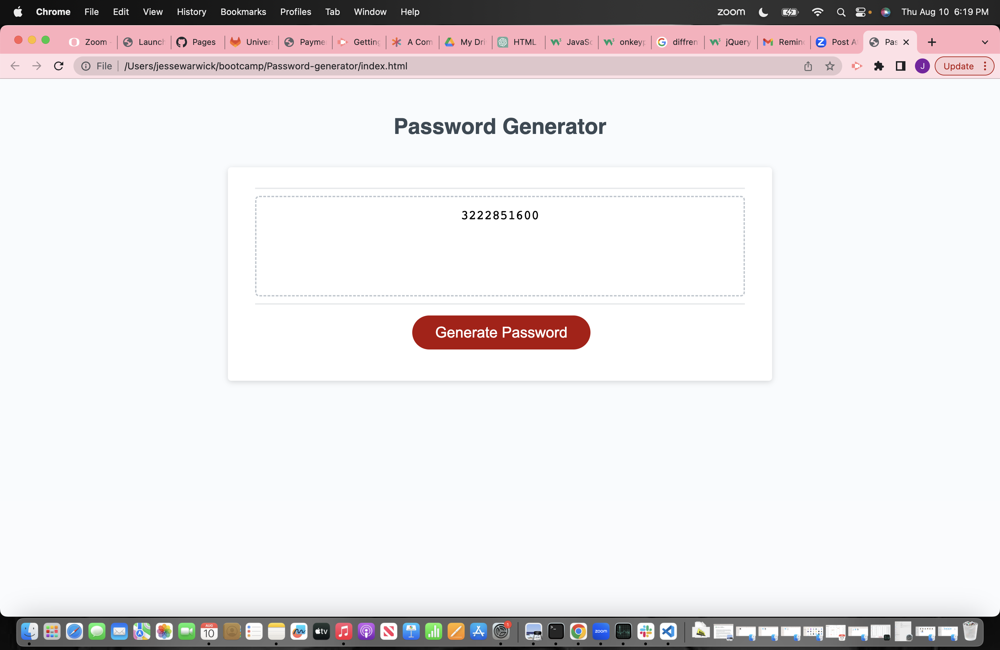

https://jcwarwick.github.io/Password-generator/

In this project I added the elements needed to make the existing site work correctly. i demoonstrated proper use and understanding of 

- if statments, 

- scope and hoisting,
 
- running functions
 
- event listeners 

- add element by id 

- and how to use the Var element correctly 